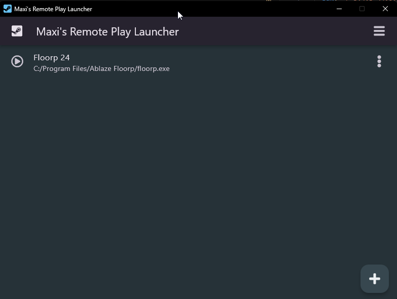

<p align="center">
  <a href="https://github.com/maximoospital/MSRemotePlayLauncher">
    
  </a>
  <br/>
  <h3 align="center">Maxi's Remote Play Launcher</h3> 
  <h5 align="center">Maximo Ospital, 2024</h5>
  <h3 align="center"><a href="https://github.com/maximoospital/MSRemotePlayLauncher/releases/latest">Download Here!</a></h3>
  <br/>
  <a href="https://ko-fi.com/I2I3ZRJ0Q" target="_blank">
    
  </a>
</p>

## Table of Contents
* [About the Project](#About-The-Project)
* [Built With](#Built-With)
* [Getting Started](#getting-started)
  * [Prerequisites](#prerequisites)
  * [Installation](#Installation)
* [Getting Started (for advanced users)](#getting-started-for-advanced-users)
  * [Prerequisites](#prerequisites)
  * [Installation](#Installation)

## About the Project



A Flutter-based app that allows users to play any game with their friends through Steam's Remote Play Together feature.

This feature's *really* useful, however it is locked down to only games enabled to do this by the dev.
I've tried apps like RemotePlayWhatever before, but i've encountered some issues with them, so the Exe-replacing method ended up being the most functional for me, and this app simplifies it for everyone.

Features:
- A flutter-powered lightweight and fast desktop app.
- Takes into account possible errors and offers quick solutions.
- Add your own games and emulators to the launcher.
- Placeholder EXE for convenience (You can individually check that exe out at [the nwreplacement repo](https://github.com/maximoospital/nwreplacement))
- Easily guided through tutorials.
 
## Built With
* [Flutter](https://flutter.dev/)
* [window_manager](https://pub.dev/packages/window_manager/)
* [path_provider](https://pub.dev/packages/path_provider)
* [url_launcher](https://pub.dev/packages/url_launcher)
* [file_picker](https://pub.dev/packages/file_picker)
* [introduction_screen](https://pub.dev/packages/introduction_screen)
* [font_awesome_flutter](https://pub.dev/packages/font_awesome_flutter)
* [archive](https://pub.dev/packages/archive)
* [path](https://pub.dev/packages/path)
* [Bat To Exe Converter](http://www.f2ko.de/en/b2e.php)
## Getting Started

### Prerequisites for manually building
- Steam

### Installation

1. Download the [latest release here](https://github.com/maximoospital/MSRemotePlayLauncher/releases/latest)

2. Unzip or install, run and follow instructions!

## Getting Started (for advanced users)

### Prerequisites for manually building
- Flutter SDK

### Installation

1. Clone repo
```sh
git clone https://github.com/maximoospital/MSRemotePlayLauncher.git
```

2. Run flubber pub get to install packages

3. Run flutter build to get binaries.


------
[](https://maximoospital.xyz) 
